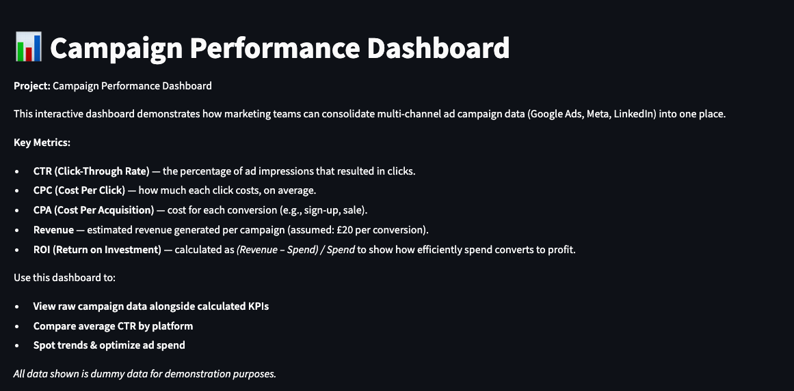
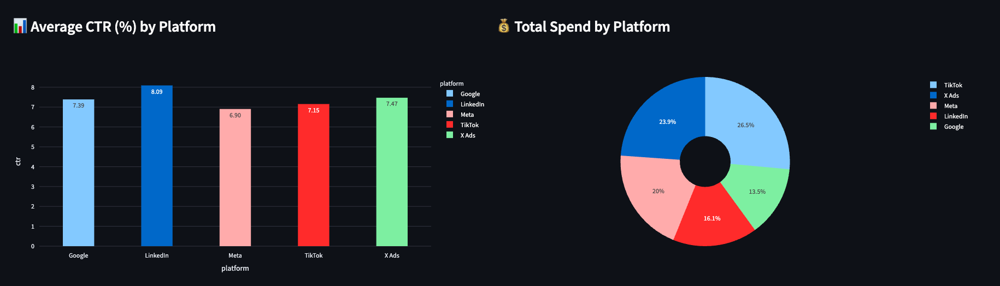
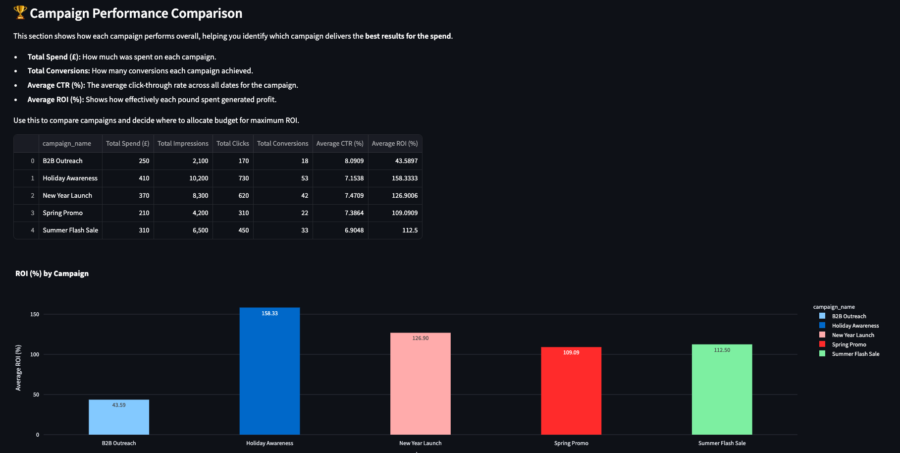

# 📊 Campaign Performance Dashboard

## 🚀 Project Overview

This project is a demo **Campaign Performance Dashboard** for client wanting to analyse their Promos!  
It shows how a small marketing team can combine ad performance data from multiple channels into one clear, interactive report.

✅ Built with **Python**, **pandas**, **Streamlit**, and **Plotly**.  
✅ Hosted for free on **Streamlit Cloud** — so anyone can view the live demo.

---

## 🎯 What Does It Do?

- **Pulls & transforms campaign data:** Loads dummy ad campaign data from CSV, then calculates key performance metrics:
  - CTR (Click-Through Rate)
  - CPC (Cost Per Click)
  - CPA (Cost Per Acquisition)
  - Revenue & ROI
- **Visualizes KPIs:** Interactive bar charts, pie charts, and tables to help stakeholders:
  - Compare platforms by average CTR
  - See spend breakdown by platform
  - Analyze which campaigns deliver the best ROI
- **No database needed:** Data stays lightweight and deploys easily.

---

## 📸 Dashboard Preview

| CTR & Spend                                        | Campaign Performance                                        |
| -------------------------------------------------- | ----------------------------------------------------------- |
|  |  |

---

## 🧩 Tech Stack

- **Python 3**
- **pandas** — data cleaning & transformations
- **Streamlit** — app framework & deployment
- **Plotly** — beautiful interactive charts

---

## 🌐 Live Demo

👉 [View the Live Dashboard on Streamlit Cloud]()
